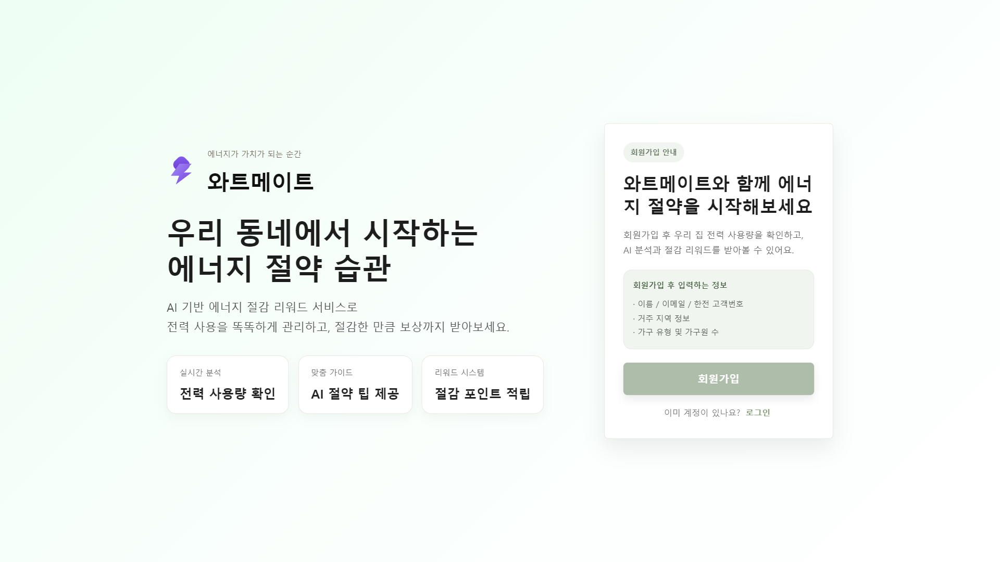
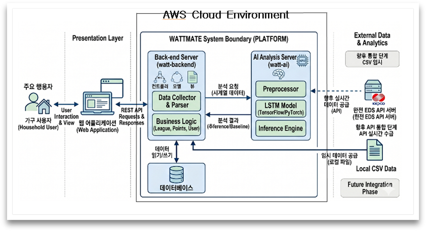
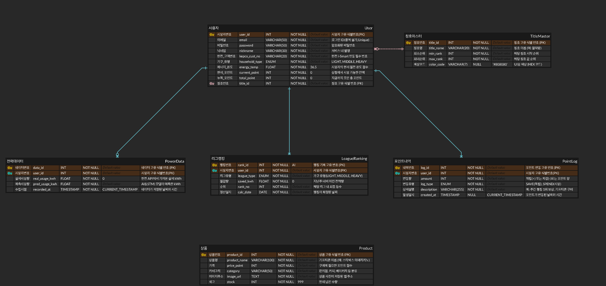
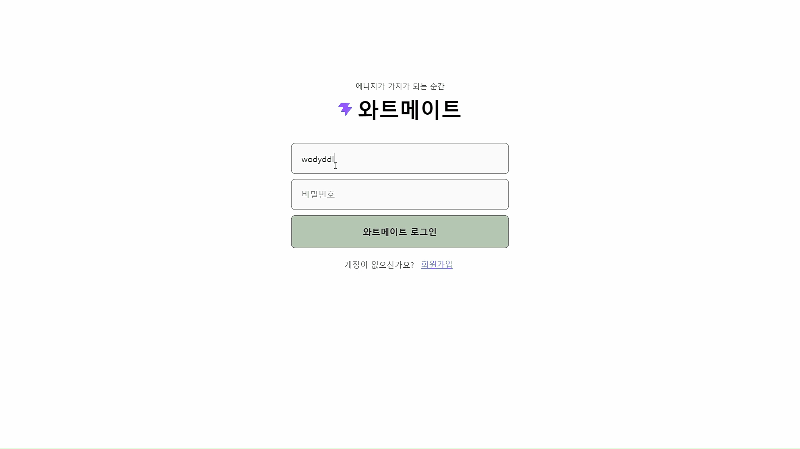

# Watt Mate

<h3 align="center">AI 기반 전력 사용량 분석 및 에너지 절약 리워드 플랫폼</h3>

<div align="center">
  
</div>

<br />

## 목차

1. [프로젝트 일정](#1-프로젝트-일정)
2. [프로젝트 개요](#2-프로젝트-개요)
3. [서비스 소개](#3-서비스-소개)
4. [주요 기능](#4-주요-기능)
5. [기술 스택](#5-기술-스택)
6. [산출물](#6-산출물)
7. [프로젝트 구조](#7-프로젝트-구조)
8. [실행 방법](#8-실행-방법)
9. [주요 API](#9-주요-api)
10. [주요 화면](#10-주요-화면)
11. [오픈소스 가치](#11-오픈소스-가치)
12. [Roadmap](#12-roadmap)
13. [Maintenance](#13-maintenance)
14. [팀 소개](#14-팀-소개)

<br />

## 1. 프로젝트 일정

---

- 기간: 2026년 3월 17일 ~ 2026년 6월 15일 (13주)
- 목표: 사용자 전력 데이터를 기반으로 사용 패턴을 분석하고, 에너지 절약 행동을 리워드로 연결하는 웹 서비스 구현

<br />

## 2. 프로젝트 개요

---

전기 사용자는 매달 고지서를 통해 전체 사용량과 요금을 확인할 수 있지만, 언제 전력을 많이 사용했는지, 이전 기간과 비교해 어떤 변화가 있었는지, 앞으로 요금이 얼마나 발생할지 직관적으로 파악하기 어렵습니다. 또한 가구별 사용 패턴이나 지역별 절약 성과를 비교하기 어려워 실질적인 절약 행동으로 이어지기 쉽지 않습니다.

Watt Mate는 사용자의 전력 사용 데이터를 시각화하고, AI 예측 모델과 요금 계산 로직을 통해 전기 사용 현황을 이해하기 쉽게 제공하는 서비스입니다. 지역 리그와 포인트 리워드 시스템을 함께 제공하여 사용자가 에너지 절약을 지속할 수 있도록 동기를 부여합니다.

<br />

## 3. 서비스 소개

---

Watt Mate는 전력 사용량 관리, 전기요금 예측, 지역 절약 랭킹, 포인트 상점을 하나의 흐름으로 제공하는 에너지 관리 플랫폼입니다.

- 전력 사용 데이터를 업로드하고 시간별, 일별, 월별 통계로 확인
- 현재 사용량을 기반으로 전기요금과 누진 구간별 예상 요금 조회
- 이전 달 대비 절감량을 기준으로 지역 리그 순위 확인
- 절약 성과에 따라 지급된 Watt Point를 상품으로 교환
- 마이페이지에서 회원 정보, 보유 포인트, 교환 쿠폰 관리

<br />

## 4. 주요 기능

---

### 회원 관리

- 이메일, 비밀번호, 닉네임, 사전 고객번호, 가구원 수 기반 회원가입
- JWT 토큰 기반 로그인 및 인증 요청 처리
- 마이페이지에서 회원 정보, 보유 포인트, 쿠폰 내역 확인

### 전력 데이터 분석

- CSV 파일 업로드를 통한 전력 데이터 등록
- 시간별 전력 사용량 조회 및 전일, 전월 동일 시간대 비교
- 일별, 월별 사용량 통계 확인
- Recharts 기반 차트로 사용량 추이 시각화

### 전기요금 예측

- 월별 사용량 기반 전기요금 계산
- 저압/고압 기준 선택에 따른 요금 비교
- 기본요금, 전력량요금, 예상 총 청구 금액 분리 표시
- 현재 월 사용량을 기반으로 예상 요금 확인

### 지역 리그 및 리워드

- 전체 사용자의 월별 절감량을 조회해 지역 절약 리그 순위 계산
- 전월 대비 절감량 기준 포인트 산정
- 상위 비율에 따른 예상 리워드 표시
- 나의 순위, 절감량, 전체 평균 사용량 확인

### 포인트 상점

- 사용자의 현재 Watt Point 조회
- 상품 목록 조회 및 포인트로 상품 교환
- 보유 포인트 부족 여부와 구매 조건 처리
- 교환 내역을 마이페이지 쿠폰 형태로 확인

### 에너지 뉴스 대시보드

- 네이버 뉴스 검색 API를 활용한 에너지 관련 최신 뉴스 배너 제공
- 월간 총 전력, 예상 요금, 보유 리워드 포인트 요약 제공

<br />

## 5. 기술 스택

---

### Data & AI


- 전력 데이터 학습과 예측 모델 구현을 위해 Python과 TensorFlow 사용
- 전력 사용 패턴의 연속성을 반영하기 위해 LSTM 계열 모델 적용
- 시계열 데이터의 시간적 패턴을 반영해 예측 모델 학습
- FastAPI로 AI 예측 API 서버를 구성해 백엔드와 연동

### Backend & DB


- 안정적이고 확장 가능한 서버 구축을 위해 Spring Boot 사용
- JPA 기반으로 사용자, 전력 데이터, 포인트, 상품 데이터를 관리
- MySQL을 메인 DB로 사용하고 AWS RDS 배포 환경을 고려해 설계
- Spring Security와 JWT를 활용한 인증/인가 처리
- REST API를 통해 프론트엔드와 AI 서버 연동

### Frontend


- 실시간 데이터 반영과 효율적인 UI 관리를 위해 React 사용
- React Router로 로그인, 회원가입, 메인 대시보드 화면 라우팅 처리
- Axios로 백엔드 REST API 요청 및 인증 토큰 기반 통신 처리
- Recharts로 전력 사용량과 통계 데이터를 직관적으로 시각화
- 실시간 대시보드를 통해 사용자의 절전 행동 변화를 유도

### DevOps & Collaboration


- GitHub를 활용한 팀원 간 협업 및 코드 버전 관리
- Notion을 활용한 프로젝트 일정, 문서, 진행 상황 관리
- Docker 기반 프론트엔드 실행 환경 구성
- Vercel을 활용한 프론트엔드 배포
- CI/CD 파이프라인을 통한 개발 흐름 및 배포 자동화 목표

<br />

## 6. 산출물

---

### 아키텍처



### ERD



<br />

## 7. 프로젝트 구조

---

```text
watt-mate/
├── README.md
├── ai/
│   ├── data/
│   │   └── user1_standard.csv
│   ├── main.py
│   ├── watt_mate_model.keras
│   └── watt_mate_scaler.pkl
├── backend/
│   ├── gradle/
│   ├── src/
│   │   ├── main/
│   │   │   ├── java/Wattmate/
│   │   │   │   ├── Controller/
│   │   │   │   ├── DTO/
│   │   │   │   ├── Entity/
│   │   │   │   ├── Repository/
│   │   │   │   ├── Security/
│   │   │   │   └── Service/
│   │   │   └── resources/
│   │   │       └── application.properties
│   │   └── test/
│   ├── build.gradle
│   ├── gradlew
│   └── settings.gradle
├── frontend/
│   ├── public/
│   ├── src/
│   │   ├── api/
│   │   ├── assets/
│   │   ├── components/
│   │   │   ├── Main/
│   │   │   │   ├── ElectricStats/
│   │   │   │   ├── LeagueStats/
│   │   │   │   ├── MyPage/
│   │   │   │   └── PointStore/
│   │   │   └── signup/
│   │   ├── css/
│   │   ├── pages/
│   │   ├── App.jsx
│   │   └── main.jsx
│   ├── Dockerfile
│   ├── docker-compose.yml
│   ├── package.json
│   ├── vercel.json
│   └── vite.config.js
└── images/
    ├── Architecture.png
    ├── ERD.png
    ├── WATTMATE.png
    ├── dataupload.gif
    ├── login.gif
    └── signupform.gif
```

<br />

## 8. 실행 방법

---

### 사전 요구 사항

- Java 17
- Node.js 20 이상 권장
- npm
- Python 3.10 이상 권장
- MySQL 또는 AWS RDS MySQL

### Backend 실행

`backend/src/main/resources/application.properties`는 환경 변수를 사용합니다.

```env
DB_URL=jdbc:mysql://localhost:3306/wattmate
DB_USERNAME=root
DB_PASSWORD=your_password
JWT_SECRET=your_jwt_secret
JWT_EXPIRATION=3600000
```

```bash
cd backend
./gradlew bootRun
```

Windows PowerShell에서는 다음 명령을 사용할 수 있습니다.

```powershell
cd backend
.\gradlew.bat bootRun
```

### AI 서버 실행

```bash
cd ai
pip install fastapi uvicorn python-multipart pandas numpy tensorflow scikit-learn joblib
uvicorn main:app --reload --port 8000
```

### Frontend 실행

`frontend/.env` 파일에 백엔드 API 주소를 설정합니다.

```env
VITE_API_BASE_URL=http://localhost:8080
```

```bash
cd frontend
npm install
npm run dev
```

### Frontend 빌드

```bash
cd frontend
npm run build
```

<br />

## 9. 주요 API

---

| 구분 | Method | Endpoint | 설명 |
| --- | --- | --- | --- |
| 회원가입 | POST | `/api/signup` | 사용자 계정 생성 |
| 로그인 | POST | `/api/login` | 로그인 및 JWT 토큰 발급 |
| 사용자 조회 | GET | `/api/users` | 사용자 목록 및 기본 정보 조회 |
| 전력 업로드 | POST | `/api/power/upload` | CSV 파일 업로드 및 전력 데이터 분석 |
| 시간별 전력 | GET | `/api/power/hourly` | 날짜 기준 시간별 전력 사용량 조회 |
| 일별 전력 | GET | `/api/power/daily` | 연/월 기준 일별 전력 사용량 조회 |
| 월별 전력 | GET | `/api/power/monthly` | 연도 기준 월별 전력 사용량 조회 |
| 상품 목록 | GET | `/api/products` | 포인트 상점 상품 조회 |
| 상품 교환 | POST | `/api/products/purchase` | Watt Point 기반 상품 교환 |
| 포인트 로그 | GET | `/api/point-logs` | 포인트 적립 및 사용 내역 조회 |
| AI 예측 | POST | `/predict` | CSV 기반 전력 사용량 예측 |

<br />

## 10. 주요 화면

---

### 회원가입

<br />

<br />

### 로그인

<br />

<br />

### 전력 데이터 업로드

<br />

<br />

<br />

## 11. 오픈소스 가치

---

Watt Mate는 전력 사용 데이터를 더 쉽게 이해하고, 절약 행동으로 연결하기 위한 공개 프로젝트입니다. 전력 사용량 시각화, 전기요금 예측, 지역 절약 랭킹, 포인트 리워드 흐름을 하나의 예제로 제공하여 에너지 관리 서비스를 만들고 싶은 개발자나 학생이 참고할 수 있는 구조를 목표로 합니다.

이 저장소는 프론트엔드, 백엔드, AI 예측 서버, 데이터 처리 흐름을 함께 포함하고 있어 단일 기능 예제가 아니라 실제 서비스 형태의 오픈소스 레퍼런스로 확장할 수 있습니다. 특히 전력 데이터 기반 서비스, 공공/생활 데이터 시각화, 에너지 절약 UX, 리워드 시스템 설계에 관심 있는 개발자가 구조와 구현 방식을 참고할 수 있도록 문서와 예제를 지속적으로 보완할 계획입니다.

현재는 초기 공개 단계이지만, README, 실행 방법, 주요 API, 화면 예시, 아키텍처와 ERD를 공개하여 프로젝트의 구조와 목적을 확인할 수 있도록 정리했습니다.

<br />

## 12. Roadmap

---

- 전력 데이터 업로드 예시와 샘플 CSV 문서 보강
- AI 예측 결과를 설명하는 리포트 생성 기능 개선
- 사용자별 절약 추천 메시지와 에너지 절약 가이드 추가
- 이슈 기반 버그 수정 및 사용성 개선
- 배포 환경과 환경 변수 설정 문서 보완
- 테스트 코드와 API 검증 절차 추가
- 프론트엔드 화면 접근성 및 반응형 UI 개선
- 릴리스 노트와 변경 이력 관리

<br />

## 13. Maintenance

---

이 프로젝트는 공개 저장소로 유지하며, 전력 데이터 분석과 에너지 절약 서비스 구현에 관심 있는 사용자가 구조를 이해하고 재사용할 수 있도록 관리합니다.

- 주요 변경 사항은 GitHub commit과 README 업데이트로 기록합니다.
- 버그나 개선 아이디어는 GitHub Issues를 통해 정리할 예정입니다.
- 기능 추가 전에는 프론트엔드, 백엔드, AI 서버 간 API 영향 범위를 확인합니다.
- 문서, 실행 방법, 환경 변수 설명은 코드 변경과 함께 최신 상태로 유지합니다.
- 외부 기여가 들어오는 경우 Pull Request를 통해 변경 의도와 동작 결과를 검토합니다.
- 보안 정보, API key, DB 접속 정보 등 민감한 값은 저장소에 포함하지 않습니다.

<br />

## 14. 팀 소개

---

<table>
  <tr>
    <th align="center">이름</th>
    <th align="center">역할</th>
    <th align="center">담당 업무</th>
  </tr>
  <tr>
    <td align="center">박재용</td>
    <td align="center">Frontend, Infra</td>
    <td align="center">React 화면 구현, API 연동, 배포 환경 구성 및 운영 관리</td>
  </tr>
  <tr>
    <td align="center">김도형</td>
    <td align="center">Backend, DB</td>
    <td align="center">로그인 인증, 전력 데이터, 포인트, 상품 API 구현</td>
  </tr>
  <tr>
    <td align="center">김성진</td>
    <td align="center">Backend, AI, DB</td>
    <td align="center">AWS 배포 관리, 전력 데이터 분석 및 예측 로직 모델 구현</td>
  </tr>
  <tr>
    <td align="center">김성준</td>
    <td align="center">AI</td>
    <td align="center">전력 데이터 분석 및 예측 로직 모델 구현</td>
  </tr>
  <tr>
    <td align="center">이건양</td>
    <td align="center">Frontend</td>
    <td align="center">React 화면 구현, 데이터 시각화</td>
  </tr>
</table>
